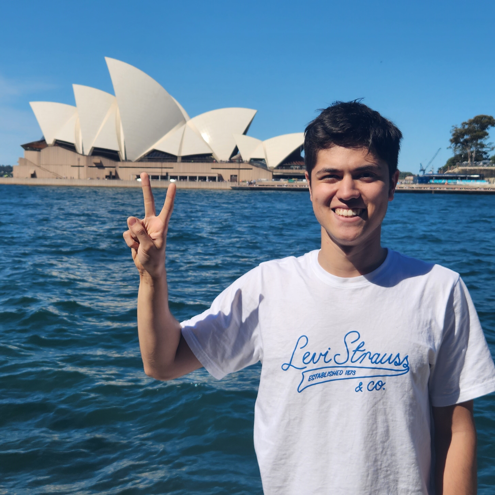

## Ken Mawer

I am Ken Mawer, a Master of Mathematics in Statistics student at the University of Waterloo who is set to graduate in August 2024.

I did my undergraduate at the University of British Columbia, where I graduated with of a Bachelor of Arts, major in Mathematics and minor in Statistics in May 2023. I completed the co-op program and earned a high distintion.

I also spent a semester on exchange at the University of New South Wales in Sydney, Australia. Read more about my experience [here](https://www.student.unsw.edu.au/canada-australia-my-exchange-journey-unsw)!
